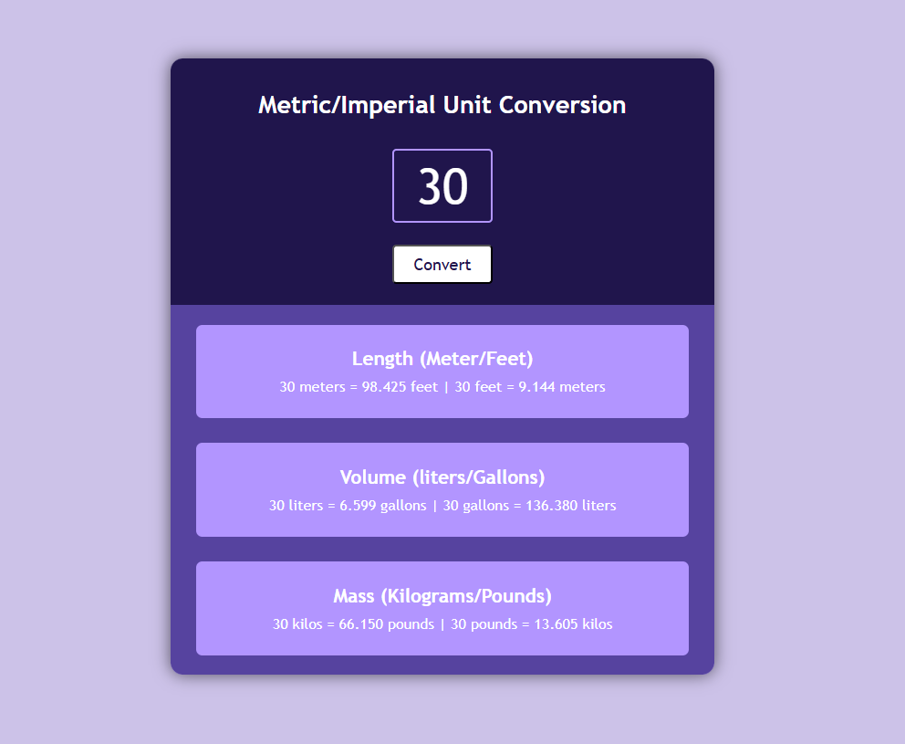

# 🌐 Metric/Imperial Unit Converter

A simple, responsive web application that converts between Metric and Imperial units. Built with Vanilla JavaScript, HTML, and CSS — no frameworks or libraries required!

---

## 🚀 Features

* Convert between:

* Length (meters ↔ feet)

* Weight (kilograms ↔ pounds)

* Volume (liters ↔ gallons)

* Clean, minimal design

---

## 📸 Preview

---

## 🛠️ Built With
* HTML5

* CSS3 (Flexbox)

* Vanilla JavaScript (ES6+)
  
---

## 🔧 How to Use -

**Open in Browser** :